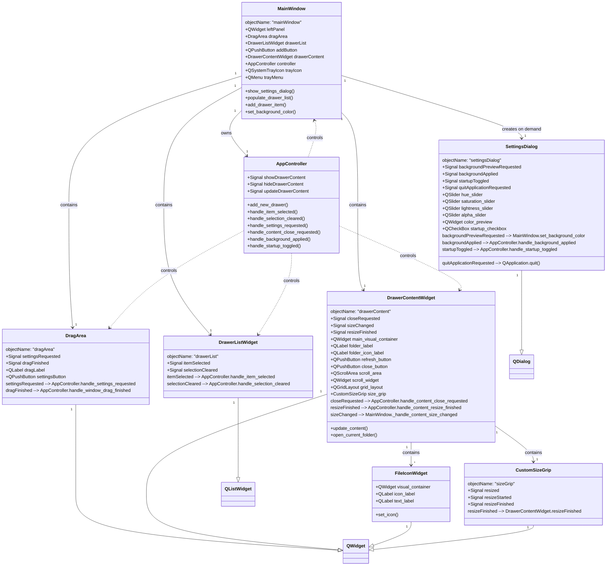

# Qt 组件关系图

以下 Mermaid 图展示了 iconDrawer 应用中 Qt 组件的层级关系和信号连接。每个组件都有明确的 objectName，用于在 style.qss 中定义样式。

## 组件 objectName 命名方案

| 组件类型 | 组件名称 | objectName |
|---------|---------|------------|
| QMainWindow | MainWindow | mainWindow |
| QWidget | 左侧面板 | leftPanel |
| DragArea | 拖拽区域 | dragArea |
| DrawerListWidget | 抽屉列表 | drawerList |
| QPushButton | 添加按钮 | addButton |
| DrawerContentWidget | 右侧内容区域 | drawerContent |
| QWidget | 内容区域容器 | drawerContentContainer |
| QLabel | 文件夹路径标签 | folderLabel |
| QLabel | 文件夹图标标签 | folderIconLabel |
| QPushButton | 刷新按钮 | refreshButton |
| QPushButton | 关闭按钮 | closeButton |
| QScrollArea | 滚动区域 | scrollArea |
| QWidget | 滚动内容区域 | scrollWidget |
| CustomSizeGrip | 大小调整手柄 | sizeGrip |
| SettingsDialog | 设置对话框 | settingsDialog |
| QMenu | 系统托盘菜单 | trayMenu |
| FileIconWidget | 文件图标部件 | fileItem |
| QWidget | 文件图标视觉容器 | visualContainer |
| QLabel | 文件图标标签 | iconLabel |
| QLabel | 文件名标签 | textLabel |

## 文件与组件对应关系

| 文件名 | 主要组件 |
|-------|---------|
| main_window.py | MainWindow |
| drag_area.py | DragArea |
| list.py | DrawerListWidget |
| content.py | DrawerContentWidget, ClickableWidget |
| file_item.py | FileIconWidget |
| custom_size_grip.py | CustomSizeGrip |
| settings_dialog.py | SettingsDialog |
| controller.py | AppController |
