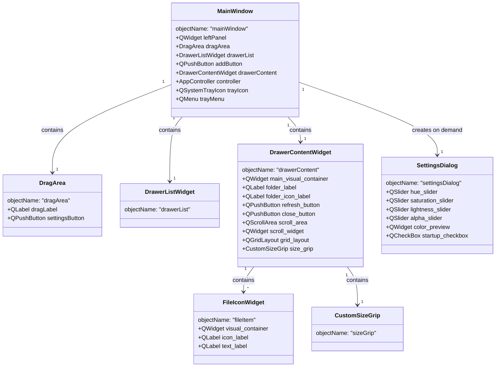
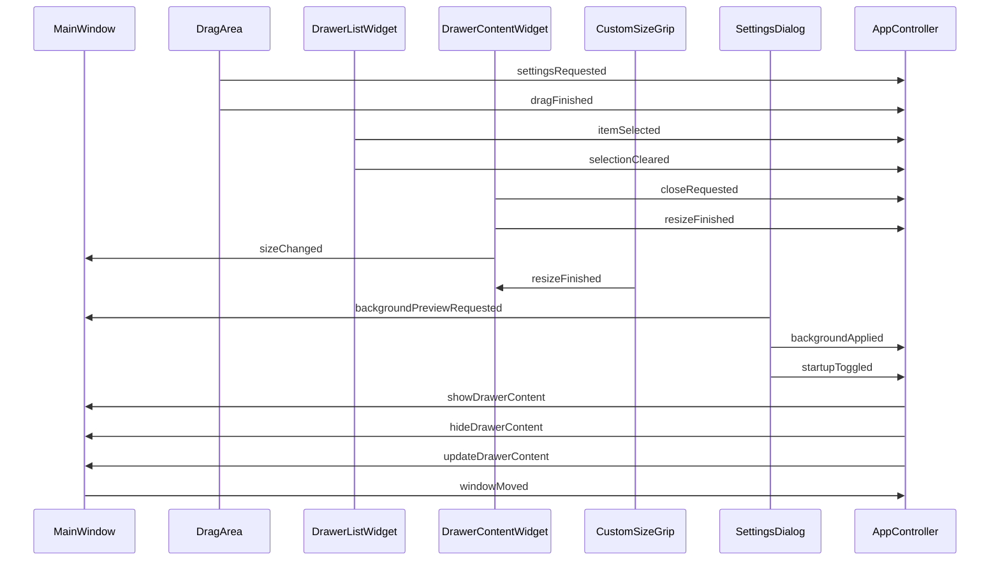

# Qt 组件命名方案总结

本文档总结了 iconDrawer 应用中所有 Qt 组件的命名方案，包括它们的 objectName 设置和样式定义。

## 组件 objectName 命名方案

| 组件类型 | 组件名称 | objectName | 文件位置 |
|---------|---------|------------|---------|
| QMainWindow | MainWindow | mainWindow | main_window.py |
| QWidget | 左侧面板 | leftPanel | main_window.py |
| DragArea | 拖拽区域 | dragArea | drag_area.py |
| QLabel | 拖拽区域标签 | dragLabel | drag_area.py |
| QPushButton | 设置按钮 | settingsButton | drag_area.py |
| DrawerListWidget | 抽屉列表 | drawerList | main_window.py |
| QPushButton | 添加按钮 | addButton | main_window.py |
| DrawerContentWidget | 右侧内容区域 | drawerContent | main_window.py |
| QWidget | 内容区域容器 | drawerContentContainer | content.py |
| QLabel | 文件夹路径标签 | folderLabel | content.py |
| QLabel | 文件夹图标标签 | folderIconLabel | content.py |
| QPushButton | 刷新按钮 | refreshButton | content.py |
| QPushButton | 关闭按钮 | closeButton | content.py |
| QScrollArea | 滚动区域 | scrollArea | content.py |
| QWidget | 滚动内容区域 | scrollWidget | content.py |
| CustomSizeGrip | 大小调整手柄 | sizeGrip | custom_size_grip.py |
| SettingsDialog | 设置对话框 | settingsDialog | settings_dialog.py |
| QMenu | 系统托盘菜单 | trayMenu | main_window.py |
| FileIconWidget | 文件图标部件 | fileItem | file_item.py |
| QWidget | 文件图标视觉容器 | visualContainer | file_item.py |

## 组件层级关系



## 信号槽连接关系



## 样式定义

所有组件的样式都在 `style.qss` 文件中定义，使用 objectName 选择器来精确控制样式。例如：

```css
/* 主窗口 */
QMainWindow#mainWindow {
    background-color: transparent;
    border-radius: 5px;
}

/* 左侧面板 */
QWidget#leftPanel {
    border-radius: 5px;
}

/* 拖拽区域 */
DragArea#dragArea {
    background-color: rgba(0, 0, 0, 180);
    border-top-left-radius: 5px;
    border-top-right-radius: 5px;
}
```

## 文件与组件对应关系

| 文件名 | 主要组件 |
|-------|---------|
| main_window.py | MainWindow |
| drag_area.py | DragArea |
| list.py | DrawerListWidget |
| content.py | DrawerContentWidget, ClickableWidget |
| file_item.py | FileIconWidget |
| custom_size_grip.py | CustomSizeGrip |
| settings_dialog.py | SettingsDialog |
| controller.py | AppController |

## 组件绘制逻辑

1. **MainWindow** 是应用的主窗口，包含左侧面板和右侧内容区域。
   - 左侧面板包含 DragArea、DrawerListWidget 和添加按钮。
   - 右侧内容区域是 DrawerContentWidget，显示选中抽屉的详细内容。

2. **DragArea** 是一个可拖拽的区域，用于移动窗口，同时包含设置按钮。

3. **DrawerListWidget** 是一个列表部件，显示所有抽屉项目。

4. **DrawerContentWidget** 是右侧内容区域，显示选中抽屉的详细内容。
   - 包含文件夹路径标签、刷新按钮、关闭按钮、滚动区域和大小调整手柄。
   - 滚动区域中显示文件图标部件（FileIconWidget）。

5. **FileIconWidget** 是文件图标部件，显示文件图标和文件名。

6. **CustomSizeGrip** 是大小调整手柄，用于调整 DrawerContentWidget 的大小。

7. **SettingsDialog** 是设置对话框，用于设置背景颜色和启动选项。

8. **AppController** 是控制器，负责业务逻辑和事件处理，连接 MainWindow 和各组件的信号槽。

## 总结

通过统一的命名方案和样式定义，iconDrawer 应用的 Qt 组件结构清晰，易于维护和扩展。每个组件都有明确的 objectName，用于在 style.qss 中定义样式，避免了样式定义的混乱和重复。
